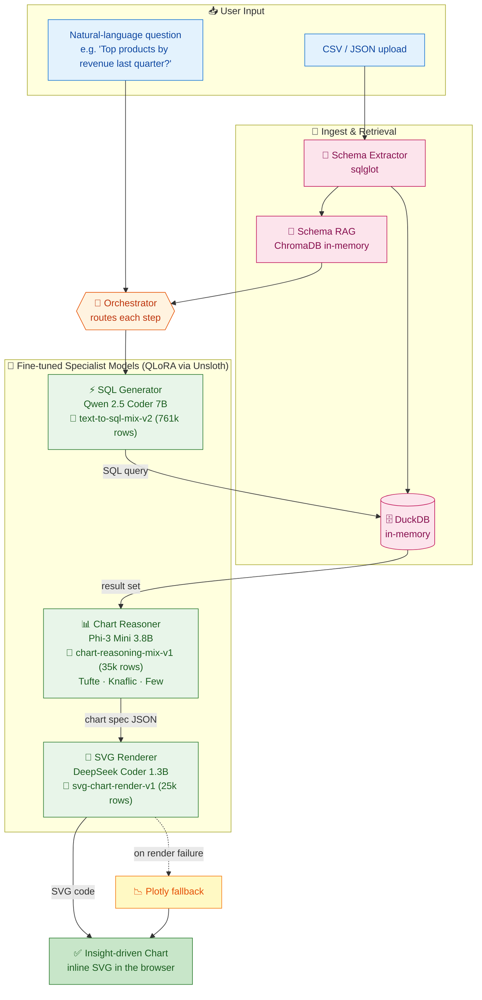

# SQL Agent LLMOps

<div align="center">


**🔗 A modular, multi-model SQL Agent with advanced orchestration, fine-tuned on open-source LLMs**

[📚 Documentation](#-features) • [🚀 Quick Start](#-quick-start) • [🏗️ Architecture](#-architecture) • [📦 Datasets](DATASETS.md) • [📝 Training](#-how-training-works) • [🤝 Contributing](#-contributing)

### 📦 Training datasets (all public on HuggingFace)

[](https://huggingface.co/datasets/DanielRegaladoCardoso/text-to-sql-mix-v2)
[](https://huggingface.co/datasets/DanielRegaladoCardoso/chart-reasoning-mix-v1)
[](https://huggingface.co/datasets/DanielRegaladoCardoso/svg-chart-render-v1)

</div>

---

## 📖 Overview

SQL Agent LLMOps is a **production-ready, open-source SQL Agent** that orchestrates multiple fine-tuned language models to convert natural language questions into SQL queries, execute them, and generate interactive visualizations. Built for scalability and deployed on HuggingFace Spaces with zero-cost GPU acceleration.

**Key Innovation:** Multi-model orchestration where each specialized model excels at its domain:
- **SQL Generation** - Qwen 2.5 Coder 7B (fine-tuned)
- **Chart Reasoning** - Phi-3 Mini 3.8B (knowledge-distilled)
- **SVG Rendering** - DeepSeek Coder 1.3B (fine-tuned)

---

## 🏗️ Architecture



---

## ✨ Features

- **🤖 Multi-Model Orchestration** - Specialized models for SQL generation, chart reasoning, and SVG rendering
- **⚡ ZeroGPU Acceleration** - SQL Generator runs on free HuggingFace ZeroGPU
- **🔍 In-Memory RAG** - User data never persisted or used for training (ChromaDB RAM-only)
- **🎯 Smart Fallbacks** - SVG rendering fails gracefully with Plotly backup
- **🧠 Knowledge Distillation** - Chart Reasoner trained via free inference API
- **📦 Open Weights** - All models fine-tuned on publicly available models
- **🚀 Production Ready** - Deployed on HuggingFace Spaces (free tier)
- **♻️ Lightweight Training** - Unsloth QLoRA reduces memory by 4x
- **📊 Data Privacy** - No data persistence, no telemetry, fully transparent

---

## 🚀 Quick Start

### Prerequisites
```bash
python >= 3.10
pip install -r requirements.txt
```

### Installation
```bash
git clone https://github.com/yourusername/sql-agent-llmops.git
cd sql-agent-llmops
pip install -e .
```

### Run Locally
```bash
# Start the Gradio web interface
python app.py

# Or run the CLI
python -m sql_agent.cli --csv "data.csv" --question "What are the top 5 products?"
```

### Deploy to HuggingFace Spaces
1. Fork this repository
2. Create a new Space on HuggingFace
3. Connect to this repo
4. Add ZeroGPU hardware (free tier available)
5. Done! Your agent is live

---

## 📁 Project Structure

```
sql-agent-llmops/
├── README.md                    # This file
├── LICENSE                      # Apache 2.0
├── requirements.txt             # Python dependencies
├── setup.py                     # Package configuration
│
├── sql_agent/
│   ├── __init__.py
│   ├── cli.py                  # Command-line interface
│   ├── orchestrator.py         # Multi-model orchestration logic
│   ├── schema_extractor.py     # SQL schema extraction
│   ├── rag_engine.py           # ChromaDB RAG retrieval
│   ├── sql_generator.py        # SQL Generation (Qwen 2.5 Coder)
│   ├── chart_reasoner.py       # Chart Config (Phi-3 Mini)
│   ├── svg_renderer.py         # SVG Rendering (DeepSeek Coder)
│   └── utils.py                # Helper functions
│
├── models/
│   ├── sql_generator_lora/     # QLoRA adapter for Qwen 2.5 Coder 7B
│   ├── chart_reasoner_lora/    # QLoRA adapter for Phi-3 Mini 3.8B
│   ├── svg_renderer_lora/      # QLoRA adapter for DeepSeek Coder 1.3B
│   └── config.yaml             # Model configurations
│
├── training/
│   ├── sql_generator_training.py      # Qwen fine-tuning on Colab
│   ├── chart_reasoner_training.py     # Phi-3 knowledge distillation
│   ├── svg_renderer_training.py       # DeepSeek fine-tuning
│   ├── datasets/
│   │   ├── sql_examples.jsonl         # 3.3M SQL training examples
│   │   ├── chart_examples.jsonl       # 100K chart config examples
│   │   └── svg_examples.jsonl         # 50K SVG examples
│   └── scripts/
│       ├── prepare_datasets.py        # Data processing
│       └── evaluate.py                # Model evaluation
│
├── tests/
│   ├── test_orchestrator.py
│   ├── test_rag_engine.py
│   └── test_models.py
│
├── app.py                      # Gradio web interface
├── space_requirements.txt       # HuggingFace Spaces dependencies
└── .github/
    └── ISSUE_TEMPLATE/
        ├── bug_report.md
        └── feature_request.md
```

---

## 🧠 How Training Works

All three models are fine-tuned with **[Unsloth](https://github.com/unslothai/unsloth)** (4-bit QLoRA) using training notebooks in [`training/notebooks/`](training/notebooks/). The full data pipeline is open-source in [`training/data_pipelines/`](training/data_pipelines/) — see [DATASETS.md](DATASETS.md) for the dataset index.

### 1. SQL Generator — Qwen 2.5 Coder 7B
- **Dataset:** [`DanielRegaladoCardoso/text-to-sql-mix-v2`](https://huggingface.co/datasets/DanielRegaladoCardoso/text-to-sql-mix-v2) — **761,155 unique rows** (train 723k / val 19k / test 19k) combining 10 public text-to-SQL sources (Spider, WikiSQL, sql-create-context, Gretel, DuckDB-text2sql, NSText2SQL, etc.). Built with [`build_sql_mix.py`](training/data_pipelines/build_sql_mix.py).
- **Method:** Unsloth QLoRA (rank 16, 4-bit base). Runs on Colab Pro A100 in ~5–8 h / epoch.
- **Inference:** HuggingFace Spaces ZeroGPU.

### 2. Chart Reasoner — Phi-3 Mini 3.8B
- **Dataset:** [`DanielRegaladoCardoso/chart-reasoning-mix-v1`](https://huggingface.co/datasets/DanielRegaladoCardoso/chart-reasoning-mix-v1) — ~75 k rows combining **nvBench** (Tsinghua DB Group, 25 k real NL↔chart pairs) + **OpenAI gpt-4.1-nano synthesis** over `text-to-sql-mix-v2` (50 k pairs generated with a storytelling-expert system prompt distilling Tufte / Knaflic / Few principles). Built with [`build_chart_mix.py`](training/data_pipelines/build_chart_mix.py).
- **Method:** Unsloth QLoRA on T4 free tier (~2–3 h / epoch).
- **Output:** structured JSON spec (chart_type, encoding, insight-driven title, sort, color_strategy, annotations, rationale).

### 3. SVG Renderer — DeepSeek Coder 1.3B
- **Dataset:** [`DanielRegaladoCardoso/svg-chart-render-v1`](https://huggingface.co/datasets/DanielRegaladoCardoso/svg-chart-render-v1) — ~25 k `(chart_spec → svg)` pairs: nvBench chart configs re-rendered with matplotlib's SVG backend + chart-shaped SVGs filtered from `umuthopeyildirim/svgen-500k`. Built with [`build_svg_mix.py`](training/data_pipelines/build_svg_mix.py).
- **Method:** Unsloth QLoRA on T4 free tier (~1–2 h / epoch).
- **Output:** inline SVG string.

### 💰 Cost breakdown

| Piece | Compute | Cost |
|-------|---------|------|
| SQL Generator training | Colab Pro A100 (~6 h) | **$10/mo** |
| Chart Reasoner training | Colab T4 free | **$0** |
| SVG Renderer training | Colab T4 free | **$0** |
| Chart dataset OpenAI synthesis | gpt-4.1-nano Batch API (50 k) | **~$2.50** |
| **End-to-end training** | | **~$12** |
| Inference hosting | HF Spaces ZeroGPU (free tier) | **$0** |

---

## 🔐 Data & Privacy (RAG)

### How RAG Works
1. **Upload:** User uploads CSV/JSON data
2. **Schema Extraction:** Automatic table schema detection
3. **Indexing:** ChromaDB in-memory vector index
4. **Retrieval:** Semantic search on user query

### Privacy Guarantees
- ✅ **In-Memory Only:** Data stored in RAM, never persisted to disk
- ✅ **No Training Data:** User data never used for model training
- ✅ **No Telemetry:** No logging, no analytics, fully transparent
- ✅ **Ephemeral Sessions:** All data deleted when session ends
- ✅ **No External API Calls:** RAG runs locally on your instance

```python
# RAG configuration (production-safe)
from chromadb.config import Settings

settings = Settings(
    is_persistent=False,  # RAM-only
    anonymized_telemetry=False,
    allow_reset=True,
)
client = chromadb.Client(settings)
```

---

## 🚀 Deployment

### HuggingFace Spaces (Recommended)

**Free Tier Setup:**
1. Create Space with Gradio template
2. Link this GitHub repo
3. Add ZeroGPU hardware (free, persistent)
4. Set environment variables:
   ```
   HF_TOKEN=hf_xxxxx
   ZeroGPU=true
   ```
5. Done! Auto-deploys on each push

**Specs:**
- CPU: 4 vCPU (shared)
- RAM: 16GB (shared)
- Storage: 50GB (ephemeral)
- GPU: T4 ZeroGPU (free, on-demand)

### Docker Deployment
```bash
docker build -t sql-agent .
docker run -p 7860:7860 sql-agent
```

### Requirements
```txt
# Core
gradio>=4.0.0
pydantic>=2.0.0
chromadb>=0.3.21

# Models
transformers>=4.35.0
torch>=2.0.0
unsloth>=2024.01

# Utils
pandas>=2.0.0
numpy>=1.24.0
```

---

## 🗺️ Roadmap

### v0.1 (Current) - Core Agent
- [x] Multi-model orchestration
- [x] SQL generation + execution
- [x] Chart reasoning
- [x] SVG rendering with Plotly fallback
- [x] ChromaDB RAG
- [x] HuggingFace Spaces deployment
- [ ] Basic documentation

### v0.2 - Enhanced Features
- [ ] Schema caching (intelligent refresh)
- [ ] Multi-table joins (cross-schema reasoning)
- [ ] Custom chart themes
- [ ] Query optimization suggestions
- [ ] Batch query processing
- [ ] Web UI improvements (dark mode, export)

### v0.3 - Production Scale
- [ ] Async execution pipeline
- [ ] Model quantization (ONNX, TensorRT)
- [ ] Caching layer for common queries
- [ ] Multi-user sessions
- [ ] Usage analytics dashboard
- [ ] Custom model training pipeline

---

## 🤝 Contributing

We welcome contributions! Here's how to get started:

1. **Fork & Clone**
   ```bash
   git clone https://github.com/yourusername/sql-agent-llmops.git
   cd sql-agent-llmops
   ```

2. **Create a Feature Branch**
   ```bash
   git checkout -b feature/your-feature
   ```

3. **Install Development Dependencies**
   ```bash
   pip install -e ".[dev]"
   ```

4. **Make Your Changes & Test**
   ```bash
   pytest tests/
   ```

5. **Submit a Pull Request**
   - Describe your changes clearly
   - Reference any related issues
   - Ensure tests pass

See [CONTRIBUTING.md](CONTRIBUTING.md) for detailed guidelines.

---

## 📜 License

This project is licensed under the **Apache License 2.0** - see [LICENSE](LICENSE) file for details.

Apache 2.0 allows:
- ✅ Commercial use
- ✅ Modification
- ✅ Distribution
- ℹ️ Must include license and copyright notice

---

## 👤 Author

**Daniel Regalado Cardoso**

- GitHub: [@yourgithub](https://github.com/yourgithub)
- Email: contact@example.com
- Twitter: [@yourhandle](https://twitter.com/yourhandle)

---

## 🙏 Acknowledgments

- **Unsloth** - Memory-efficient fine-tuning
- **HuggingFace** - Model hosting & Spaces
- **ChromaDB** - Vector embeddings
- **Gradio** - Web interface framework
- **OpenAI Evals** - Evaluation framework
- Community datasets: WikiSQL, Spider, and more

---

## 📞 Support

- 🐛 **Report Bugs:** [GitHub Issues](https://github.com/yourusername/sql-agent-llmops/issues)
- 💡 **Request Features:** [Feature Requests](https://github.com/yourusername/sql-agent-llmops/issues/new?template=feature_request.md)
- 💬 **Discussions:** [GitHub Discussions](https://github.com/yourusername/sql-agent-llmops/discussions)
- 📧 **Email:** contact@example.com

---

<div align="center">

⭐ **If you find this project useful, please consider giving it a star!** ⭐

[GitHub](https://github.com/yourusername/sql-agent-llmops) • [HuggingFace](https://huggingface.co/spaces/yourusername/sql-agent-llmops)

Made with ❤️ by the SQL Agent team

</div>
