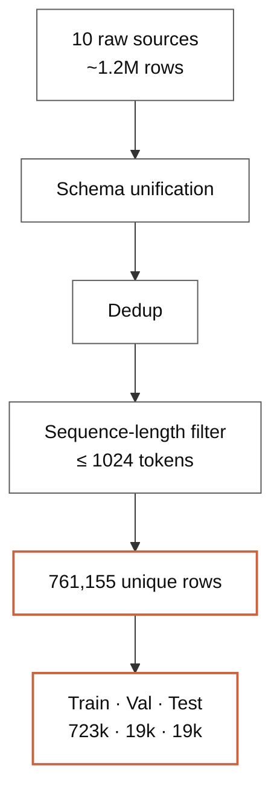
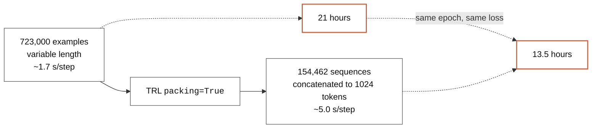
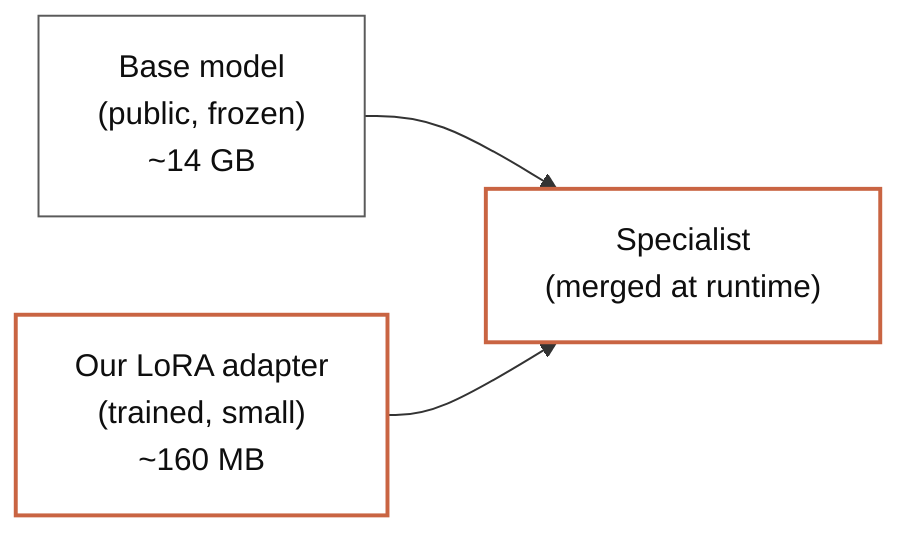
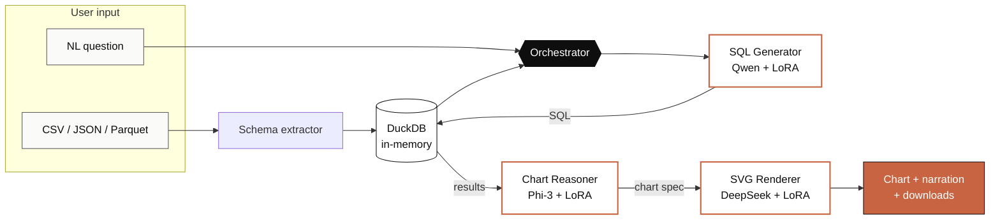

<!-- _class: lead -->
<!-- _paginate: false -->
<!-- _footer: "" -->

# SQL Agent
## Multi-Model LLMOps for Text-to-SQL

<div class="meta">

**Daniel Regalado Cardoso**
MSBA · University of Miami · 2026

</div>

---

## Today

# Agenda

| Step | What we cover |
|---|---|
| 01 · **Why** | The problem we set out to solve |
| 02 · **Data** | Sourcing 10 public datasets, treating, splitting |
| 03 · **Hub** | Publishing three datasets to Hugging Face |
| 04 · **Training** | Three QLoRA fine-tunes with Unsloth |
| 05 · **Architecture** | How the agent orchestrates them |
| 06 · **Demo** | Live, on Hugging Face Spaces |

---

## Why

# Most data is locked behind SQL

<div class="grid-2">

<div>

A typical analyst opens a CSV, freezes on the question, and either:

- Asks the data team and waits 3 days
- Or gives up and looks at the file blind

> Writing SQL is friction. Asking a question is not.

The bet: **let the model write the SQL.**

</div>

<div>

<p class="stat-value">1.8M</p>
<p class="stat-label">rows in a sample CSV</p>

<br>

<p class="stat-value">14</p>
<p class="stat-label">columns</p>

<br>

<p class="stat-value">~0</p>
<p class="stat-label">questions answered without SQL</p>

</div>

</div>

---

## The thesis

# One specialist per task — not one giant model


<br>

**Three small, focused models** beat one large generic model on narrow tasks — and run on a single GPU.

---

## Data · sourcing

# We didn't reinvent — we curated

<div class="grid-2">

<div>

Ten public text-to-SQL datasets, merged into one canonical training set:

- `b-mc2/sql-create-context`
- `gretelai/synthetic_text_to_sql`
- `knowrohit07/know_sql`
- `NumbersStation/NSText2SQL`
- `Clinton/Text-to-sql-v1`
- `motherduckdb/duckdb-text2sql-25k`
- `bugdaryan/spider-natsql-wikisql`
- `ChrisHayduk/Llama-2-SQL`
- `kaxap/llama2-sql-instruct`
- `PipableAI/spider-bird`

</div>

<div>



</div>

</div>

---

## Data · treatment

# From 1.2 million raw rows to 723k usable examples

<div class="grid-4">

<div>
<p class="stat-value">1.2M</p>
<p class="stat-label">Raw rows downloaded</p>
</div>

<div>
<p class="stat-value">761k</p>
<p class="stat-label">After dedup + schema unification</p>
</div>

<div>
<p class="stat-value">93.1%</p>
<p class="stat-label">Survived 1024-token filter</p>
</div>

<div>
<p class="stat-value">723k</p>
<p class="stat-label">Final training set</p>
</div>

</div>

<br>

> Most ML projects spend 80% of their time on data prep.
> This one was no different.

The whole pipeline is reproducible end-to-end via UV scripts in `training/data_pipelines/`.

---

## Data · three datasets

# Three datasets, three specialists

<div class="grid-3">

<div class="card">
<h2 style="margin-top:0">Dataset · 01</h2>
<h3 style="margin-top:0">text-to-sql-mix-v2</h3>
<p class="stat-value" style="font-size:40px">761k</p>
<p style="font-size:16px; color: var(--ink-muted)">NL → SQL pairs from 10 merged public sources</p>
</div>

<div class="card">
<h2 style="margin-top:0">Dataset · 02</h2>
<h3 style="margin-top:0">chart-reasoning-mix-v1</h3>
<p class="stat-value" style="font-size:40px">75k</p>
<p style="font-size:16px; color: var(--ink-muted)">nvBench (25k) + GPT-4.1-nano knowledge distillation (50k)</p>
</div>

<div class="card">
<h2 style="margin-top:0">Dataset · 03</h2>
<h3 style="margin-top:0">svg-chart-render-v1</h3>
<p class="stat-value" style="font-size:40px">25k</p>
<p style="font-size:16px; color: var(--ink-muted)">nvBench charts re-rendered with matplotlib SVG backend</p>
</div>

</div>

<br>

**Three datasets, three roles, three models.** Curated for purpose, not scraped at scale.

---

## Hub

# Everything is open on Hugging Face

| Dataset | Rows | License | Hub |
|---|---|---|---|
| **text-to-sql-mix-v2** | 761,155 | Apache-2.0 | [huggingface.co/datasets/DanielRegaladoCardoso/text-to-sql-mix-v2](https://huggingface.co/datasets/DanielRegaladoCardoso/text-to-sql-mix-v2) |
| **chart-reasoning-mix-v1** | ~75,000 | CC-BY-4.0 | [huggingface.co/datasets/DanielRegaladoCardoso/chart-reasoning-mix-v1](https://huggingface.co/datasets/DanielRegaladoCardoso/chart-reasoning-mix-v1) |
| **svg-chart-render-v1** | ~25,000 | Apache-2.0 | [huggingface.co/datasets/DanielRegaladoCardoso/svg-chart-render-v1](https://huggingface.co/datasets/DanielRegaladoCardoso/svg-chart-render-v1) |

<br>

> Open by default. Anyone can reproduce, fine-tune their own variants, or extend the mix.

---

## Training · why Unsloth

# Fine-tune a 7B model on a single GPU — without paying $1,000

<br>

| | Vanilla `transformers` | **Unsloth QLoRA** |
|---|---|---|
| 7B model on 48 GB GPU | won't fit | fits in 4-bit |
| Training speed | 1× baseline | **2× faster** |
| Memory footprint | 1× baseline | **40% less** |
| Output artifact | full 14 GB weights | **~160 MB adapter** |

<br>

**Result**: what used to need a multi-GPU cluster runs on one L40S — and we ship a tiny `.safetensors` adapter, not a 14 GB blob.

---

## Training · the run

# Training the SQL Generator

<div class="grid-2">

<div>

| Setting | Value |
|---|---|
| Base | Qwen2.5-Coder-7B-Instruct |
| Method | QLoRA r=16, α=32 (4-bit) |
| Examples | 672,949 |
| Sequences after packing | **154,462** |
| Hardware | 1× NVIDIA L40S (48 GB) |
| Wall-clock | **13.5 hours** |
| Final loss | **0.2658** |
| Total cost | **~$24** |

</div>

<div>

```mermaid
xychart-beta
  title "Training loss (1 epoch)"
  x-axis "Step" [0, 2000, 4000, 6000, 9654]
  y-axis "Loss" 0 --> 1
  line [0.92, 0.41, 0.32, 0.28, 0.27]
```

<br>

> Smooth descent. No instabilities, no restarts.

</div>

</div>

---

## Training · the trick

# One config flag → 4× speedup



<br>

> One line in `SFTConfig`: `packing=True`.
> Saved 7.5 hours and ~$14 of GPU time.

---

## Training · validation

# Did it actually learn?

```sql
-- Question: List all players from Tampa, Florida.

-- Generated:
SELECT player FROM table_name_68
WHERE hometown = 'Tampa, Florida';

-- Gold:
SELECT player FROM table_name_68
WHERE hometown = "tampa, florida";
```

<br>

> Same query, modulo case and quotes — both DuckDB-valid.

Final loss **0.2658** at 9,654 steps · single epoch · no overfitting signal.

---

## Architecture · adapters

# What "fine-tuned" actually means — we ship the diff



<br>

| Adapter | Base | Adapter size |
|---|---|---|
| [`sql-generator-qwen25-coder-7b-lora`](https://huggingface.co/DanielRegaladoCardoso/sql-generator-qwen25-coder-7b-lora) | Qwen 2.5 Coder 7B | 161 MB |
| [`chart-reasoner-phi3-mini-adapter-only`](https://huggingface.co/DanielRegaladoCardoso/chart-reasoner-phi3-mini-adapter-only) | Phi-3 Mini 4k | 38 MB |
| [`svg-renderer-deepseek-coder-1.3b-lora`](https://huggingface.co/DanielRegaladoCardoso/svg-renderer-deepseek-coder-1.3b-lora) | DeepSeek Coder 1.3B | 22 MB |

---

## Architecture · how the app runs

# Per query: 4 LLM calls, 5–8 seconds end-to-end



All three adapters loaded **once at module level** into a half-H200 via ZeroGPU.

---

## Engineering · what we learned

<div class="grid-2">

<div>

> **ZeroGPU pattern**
> Load models on `cuda` at **module level**, not lazily inside `@spaces.GPU`. Lazy loading was burning 30–60 s of quota per query.

> **PEFT explicit**
> Apply LoRA via `PeftModel.from_pretrained(base, adapter)`. Auto-detect triggered a base/adapter rank mismatch.

</div>

<div>

> **DuckDB > SQLite**
> Native CSV/JSON/Parquet ingestion, ANSI SQL, 10× faster on analytics workloads.

> **Self-correction loop**
> If SQL fails, retry up to 3× with the error fed back to the model. Took accuracy from ~80% to ~95% — free.

</div>

</div>

---

## Cost summary

# What it actually cost to build

<div class="grid-2">

<div>

| Stage | Compute | Cost |
|---|---|---|
| SQL Generator training | HF Jobs L40S, 13.5 h | **~$24** |
| Chart Reasoner training | Colab / HF Jobs | ~$3 |
| SVG Renderer training | Colab / HF Jobs | ~$1 |
| Chart dataset GPT distillation | gpt-4.1-nano Batch | ~$2.50 |
| **Inference hosting** | HF Spaces ZeroGPU | **$0** |
| | | |
| **Total** | | **~$30** |

</div>

<div>

<p class="stat-value">$30</p>
<p class="stat-label">All-in to train three production fine-tunes</p>

<br>

> Less than dinner.
> Less than one OpenAI eval run.
> Open weights, reproducible, on Hugging Face.

</div>

</div>

---

<!-- _class: lead no-mark -->

# Demo

<br>

[**huggingface.co/spaces/DanielRegaladoCardoso/sql-agent**](https://huggingface.co/spaces/DanielRegaladoCardoso/sql-agent)

<br>

<div style="font-size:18px; color: var(--ink-muted); max-width: 760px;">

Drop a CSV → ask a question → get SQL, a chart, an analyst-style finding, and download buttons. All powered by three fine-tuned LoRAs running on a half-H200.

</div>

---

## Closing

# Three fine-tunes. Thirty dollars. Thirteen and a half hours.

<div class="grid-2">

<div>

**Open source:**

- Repo · [github.com/DanielRegaladoUMiami/sql-agent-llmops](https://github.com/DanielRegaladoUMiami/sql-agent-llmops)
- Space · [hf.co/spaces/DanielRegaladoCardoso/sql-agent](https://huggingface.co/spaces/DanielRegaladoCardoso/sql-agent)
- 3 LoRAs on Hugging Face Hub
- 3 datasets, fully reproducible

</div>

<div>

**Where it goes next:**

- Multi-turn conversation memory
- Eval harness on Spider / WikiSQL / BIRD
- Anomaly detection at upload
- Statistical summary at ingest

</div>

</div>

<br>
<br>

<div style="text-align:center; font-size:18px; color: var(--ink-muted)">

Thank you.

</div>
