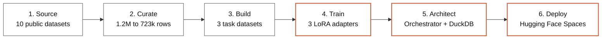
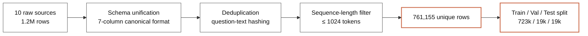
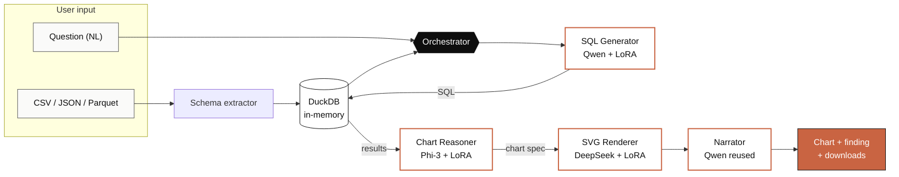

<!-- _class: lead -->
<!-- _paginate: false -->

# SQL Agent

A multi-model system for natural-language data analysis

 

**Daniel Regalado Cardoso · Nefeli Zafeiri · Oliver Mazariegos · Eleniz Espina**
MSBA · University of Miami · 2026

---

## Problem statement

# Tabular data analysis still requires SQL knowledge

Business users frequently have:

- Tabular data they need to query
- Specific questions in mind
- No working SQL knowledge

Existing options (manual SQL, generic chatbots, BI tools) each have trade-offs in cost, accuracy, or accessibility.

### Objective

Build a system that:

1. Accepts a CSV or JSON file as input
2. Accepts a question in natural language
3. Returns the answer as a chart and a written finding
4. Runs at low cost on free GPU infrastructure

---

## Methodology

# Six phases from raw data to deployed system

Each phase produces a reproducible artifact. Repository contains the scripts to recreate each step.

---

## Phase 1 — Sourcing

# Aggregating ten public text-to-SQL datasets

Selected ten existing datasets covering different schemas and SQL dialects:

- `b-mc2/sql-create-context`
- `gretelai/synthetic_text_to_sql`
- `knowrohit07/know_sql`
- `NumbersStation/NSText2SQL`
- `Clinton/Text-to-sql-v1`
- `motherduckdb/duckdb-text2sql-25k`
- `bugdaryan/spider-natsql-wikisql`
- `ChrisHayduk/Llama-2-SQL`
- `kaxap/llama2-sql-instruct`
- `PipableAI/spider-bird`

### Rationale

Building a corpus from scratch was not feasible within the project timeline. Public datasets give us schema diversity and large coverage with permissive licenses.

### Combined size

Approximately 1.2 million rows before cleaning. Heterogeneous formats and varying quality, requiring substantial pre-processing.

---

## Phase 2 — Curation

# Cleaning the merged corpus

1.2M

Raw rows

761k

After deduplication

93%

Pass length filter

723k

Final training set

All transformations reproducible via UV scripts in `training/data_pipelines/`.

---

## Phase 3 — Task datasets

# Three datasets, one per model task

| Dataset | Rows | Source | Hub |
|---|---|---|---|
| **text-to-sql-mix-v2** | 761,155 | 10 merged public sources | [link](https://huggingface.co/datasets/DanielRegaladoCardoso/text-to-sql-mix-v2) |
| **chart-reasoning-mix-v1** | ~75,000 | nvBench (25k) + GPT-4.1-nano distillation (50k) | [link](https://huggingface.co/datasets/DanielRegaladoCardoso/chart-reasoning-mix-v1) |
| **svg-chart-render-v1** | ~25,000 | nvBench charts re-rendered via matplotlib SVG | [link](https://huggingface.co/datasets/DanielRegaladoCardoso/svg-chart-render-v1) |

All three published openly on Hugging Face Hub under permissive licenses (Apache-2.0, CC-BY-4.0).

---

## Phase 4 — Training setup

# QLoRA via Unsloth

We use 4-bit QLoRA with the Unsloth library for all three fine-tunes.

Reasons for this choice:

- Allows training a 7B model on a single 48 GB GPU
- Approximately 2× faster than vanilla `transformers`
- Approximately 40% lower memory consumption
- Output is a 160 MB adapter rather than 14 GB of full weights

| | Vanilla | Unsloth |
|---|---|---|
| 7B on 48 GB GPU | does not fit | fits in 4-bit |
| Speed | baseline | ~2× faster |
| Memory | baseline | ~40% less |
| Output artifact | 14 GB | 160 MB adapter |

---

## Phase 4 — Three fine-tunes (1 of 3)

# Model 01 · SQL Generator

Model 01

### SQL Generator

**Function**
Translates a natural-language question + schema into a valid SQL query.

**Base model**
Qwen 2.5 Coder 7B Instruct

**Training dataset**
[`text-to-sql-mix-v2`](https://huggingface.co/datasets/DanielRegaladoCardoso/text-to-sql-mix-v2) — 672,949 examples used (after seq-len filter)

**Training method**
QLoRA r=16, α=32, 4-bit base · TRL `packing=True` (154,462 packed sequences) · 1 epoch · 9,654 steps

**Hardware**
1× NVIDIA L40S (48 GB) on Hugging Face Jobs

13.5h

Wall-clock time

0.27

Final loss

~$24

Compute cost

161 MB

Adapter size

 

**Hub**
[`sql-generator-qwen25-coder-7b-lora`](https://huggingface.co/DanielRegaladoCardoso/sql-generator-qwen25-coder-7b-lora)

> Sequence packing reduced training time from ~21 h to 13.5 h.

---

## Phase 4 — Three fine-tunes (2 of 3)

# Model 02 · Chart Reasoner

Model 02

### Chart Reasoner

**Function**
Given a question and SQL result rows, decides the chart type and which columns to plot.

**Base model**
Microsoft Phi-3 Mini 4k Instruct

**Training dataset**
[`chart-reasoning-mix-v1`](https://huggingface.co/datasets/DanielRegaladoCardoso/chart-reasoning-mix-v1) — ~75k pairs (25k nvBench + 50k GPT-4.1-nano knowledge distillation)

**Training method**
QLoRA r=16, α=32, 4-bit base · 1 epoch · structured-JSON output objective

**Hardware**
HF Jobs A10G / Colab Pro

~3h

Wall-clock time

~0.31

Final loss

~$3

Compute cost

38 MB

Adapter size

 

**Hub**
[`chart-reasoner-phi3-mini-adapter-only`](https://huggingface.co/DanielRegaladoCardoso/chart-reasoner-phi3-mini-adapter-only)

> Outputs a JSON spec with chart_type, x_column, y_column, title, color, rationale.

---

## Phase 4 — Three fine-tunes (3 of 3)

# Model 03 · SVG Renderer

Model 03

### SVG Renderer

**Function**
Given a chart spec and data, produces inline SVG markup for the visualization.

**Base model**
DeepSeek Coder 1.3B Instruct

**Training dataset**
[`svg-chart-render-v1`](https://huggingface.co/datasets/DanielRegaladoCardoso/svg-chart-render-v1) — ~25k chart-spec → SVG pairs from nvBench charts re-rendered via matplotlib

**Training method**
QLoRA r=16, α=32, 4-bit base · 1 epoch · code-generation objective

**Hardware**
Colab T4

~2h

Wall-clock time

~0.40

Final loss

~$1

Compute cost

22 MB

Adapter size

 

**Hub**
[`svg-renderer-deepseek-coder-1.3b-lora`](https://huggingface.co/DanielRegaladoCardoso/svg-renderer-deepseek-coder-1.3b-lora)

> When the model output fails SVG validation, the system falls back to a themed Plotly renderer.

---

## Phase 5 — System architecture

# End-to-end query flow

End-to-end latency: 5–8 seconds on a warm GPU. Adapters loaded once at module level on a half-H200 via Hugging Face ZeroGPU. Self-correcting SQL: failed queries retried up to 3× with the error in context.

---

## Phase 6 — Deployment and cost

# Total compute cost: approximately $30

| Stage | Compute | Cost |
|---|---|---|
| SQL Generator training | HF Jobs L40S, 13.5 h | ~$24 |
| Chart Reasoner training | Colab / HF Jobs | ~$3 |
| SVG Renderer training | Colab / HF Jobs | ~$1 |
| GPT-4.1-nano dataset distillation | OpenAI Batch API | ~$2.50 |
| Inference hosting | HF Spaces ZeroGPU | $0 |
| **Total** | | **~$30** |

### Why the cost is low

- Unsloth QLoRA reduces training memory and time
- Sequence packing further reduces SQL training time
- HF Spaces ZeroGPU provides free on-demand GPU for inference
- Only adapters are stored, not full model weights

---

<!-- _class: lead -->

# Live system demo

 

[**huggingface.co/spaces/DanielRegaladoCardoso/sql-agent**](https://huggingface.co/spaces/DanielRegaladoCardoso/sql-agent)

 

Upload a CSV, ask a question in English. The system returns the generated SQL, query results, a chart, and a one to two sentence written finding.

---

## Conclusion

# Summary and future work

### What we delivered

- Three open-source datasets on Hugging Face
- Three QLoRA adapters trained on those datasets
- A working multi-model agent that answers questions about uploaded data
- Total compute cost approximately $30

### Limitations and future work

- Quantitative evaluation on Spider, WikiSQL, BIRD
- Multi-turn conversational memory
- Anomaly detection on uploaded data
- Statistical summary at ingestion

**Repository:** [github.com/DanielRegaladoUMiami/sql-agent-llmops](https://github.com/DanielRegaladoUMiami/sql-agent-llmops)

 

Daniel Regalado Cardoso · Nefeli Zafeiri · Oliver Mazariegos · Eleniz Espina
