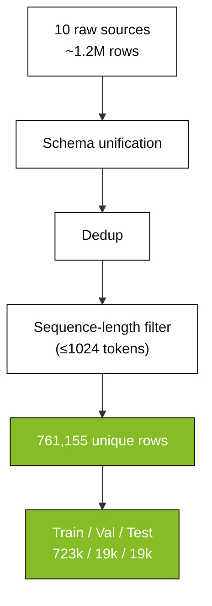
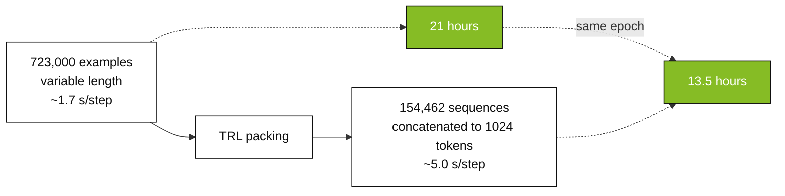
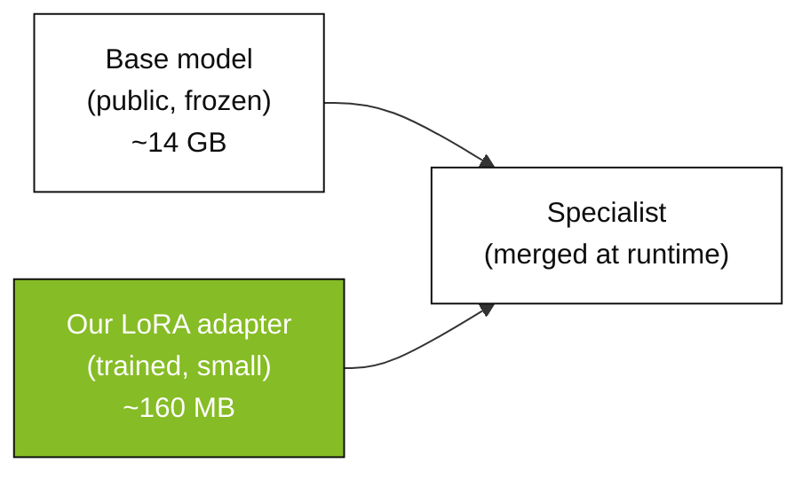
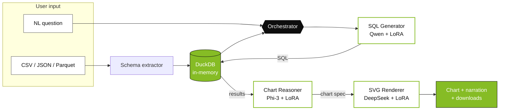

<!-- _class: lead title-page -->
<!-- _paginate: false -->
<!-- _footer: "" -->

# SQL Agent
## Multi-Model LLMOps for Text-to-SQL

<br>

**Daniel Regalado Cardoso**
MSBA · University of Miami · 2026

---

<!-- _header: "Agenda" -->

## Today

# What we'll walk through

<div class="grid-3">

<div class="card">
<div class="card-title">01 · Why</div>

The problem we set out to solve.

</div>

<div class="card">
<div class="card-title">02 · Data</div>

Sourcing, curating, and treating real text-to-SQL data.

</div>

<div class="card">
<div class="card-title">03 · Hub</div>

Publishing three datasets to Hugging Face.

</div>

<div class="card">
<div class="card-title">04 · Training</div>

Three fine-tuned LoRAs with Unsloth + QLoRA.

</div>

<div class="card">
<div class="card-title">05 · Architecture</div>

How the agent orchestrates all three.

</div>

<div class="card">
<div class="card-title">06 · Demo</div>

Live, on Hugging Face Spaces.

</div>

</div>

---

<!-- _header: "Why" -->

## Why we built it

# Most data is locked behind SQL

<div class="grid-2">

<div>

A typical analyst opens a spreadsheet, freezes on the question, and either:

- Asks the data team and waits 3 days, or
- Gives up and looks at the file blind.

> Writing SQL is friction. Asking a question is not.

The bet: **let the model write the SQL.**

</div>

<div>

<div class="stat">
<div class="stat-value">1.8M</div>
<div class="stat-label">rows in a sample CSV</div>
</div>

<br>

<div class="stat">
<div class="stat-value">14</div>
<div class="stat-label">columns</div>
</div>

<br>

<div class="stat">
<div class="stat-value">~0</div>
<div class="stat-label">questions answered without SQL</div>
</div>

</div>

</div>

---

<!-- _header: "The thesis" -->

## What we're betting on

# One specialist per task, not one giant model

<br>


<br>

**Three small, focused models** beat one large generic model on narrow tasks — and run on a single GPU.

---

<!-- _header: "Data · sourcing" -->

## Data — where it came from

# We didn't reinvent. We curated.

<br>

<div class="grid-2">

<div>

Ten public text-to-SQL datasets, merged into one:

- `b-mc2/sql-create-context`
- `gretelai/synthetic_text_to_sql`
- `knowrohit07/know_sql`
- `NumbersStation/NSText2SQL`
- `Clinton/Text-to-sql-v1`
- `motherduckdb/duckdb-text2sql-25k`
- `bugdaryan/spider-natsql-wikisql`
- `ChrisHayduk/Llama-2-SQL`
- `kaxap/llama2-sql-instruct`
- `PipableAI/spider-bird`

</div>

<div>



</div>

</div>

---

<!-- _header: "Data · treatment" -->

## How we cleaned it

# From 1.2M raw rows to 723k usable training examples

<br>

<div class="grid-4">

<div class="stat">
<div class="stat-value">1.2M</div>
<div class="stat-label">Raw rows downloaded</div>
</div>

<div class="stat">
<div class="stat-value">761k</div>
<div class="stat-label">After dedup + schema unification</div>
</div>

<div class="stat">
<div class="stat-value">93.1%</div>
<div class="stat-label">Survived 1024-token filter</div>
</div>

<div class="stat">
<div class="stat-value">723k</div>
<div class="stat-label">Final training set</div>
</div>

</div>

<br>
<br>

> Most ML projects spend 80% of their time on data prep.
> This one was no different.

<br>

Pipeline is reproducible end-to-end via UV scripts in `training/data_pipelines/`.

---

<!-- _header: "Data · three datasets" -->

## We built three datasets — one per specialist

<br>

<div class="grid-3">

<div class="card-accent">
<div class="card-title">SQL Training</div>
<div class="stat-value">761k</div>
<p style="font-size:18px; color: var(--ink-muted); margin-top:12px">
<strong>text-to-sql-mix-v2</strong><br>
NL → SQL pairs from 10 merged sources
</p>
</div>

<div class="card-accent">
<div class="card-title">Chart Reasoning</div>
<div class="stat-value">75k</div>
<p style="font-size:18px; color: var(--ink-muted); margin-top:12px">
<strong>chart-reasoning-mix-v1</strong><br>
nvBench (25k) + GPT-4.1-nano knowledge distillation (50k)
</p>
</div>

<div class="card-accent">
<div class="card-title">SVG Rendering</div>
<div class="stat-value">25k</div>
<p style="font-size:18px; color: var(--ink-muted); margin-top:12px">
<strong>svg-chart-render-v1</strong><br>
nvBench charts re-rendered with matplotlib SVG backend
</p>
</div>

</div>

<br>

**Three datasets, three roles, three models.** Curated for purpose, not scraped at scale.

---

<!-- _header: "Hub" -->

## Everything is open

# All three datasets live on Hugging Face

<br>

<div class="grid-3">

<div class="card">
<div class="card-title">Hub</div>
<h3 style="margin-top:4px">text-to-sql-mix-v2</h3>
<p style="font-size:16px; color: var(--ink-muted)">761,155 rows · Apache 2.0<br><code>DanielRegaladoCardoso/text-to-sql-mix-v2</code></p>
</div>

<div class="card">
<div class="card-title">Hub</div>
<h3 style="margin-top:4px">chart-reasoning-mix-v1</h3>
<p style="font-size:16px; color: var(--ink-muted)">~75k rows · CC-BY-4.0<br><code>DanielRegaladoCardoso/chart-reasoning-mix-v1</code></p>
</div>

<div class="card">
<div class="card-title">Hub</div>
<h3 style="margin-top:4px">svg-chart-render-v1</h3>
<p style="font-size:16px; color: var(--ink-muted)">~25k rows · Apache 2.0<br><code>DanielRegaladoCardoso/svg-chart-render-v1</code></p>
</div>

</div>

<br>

> Open by default. Anyone can reproduce, fine-tune, or remix.

---

<!-- _header: "Training · why Unsloth" -->

## Why Unsloth + QLoRA

# Fine-tune a 7B model on a single GPU. Without paying $1,000.

<br>

| | Vanilla Transformers | **Unsloth QLoRA** |
|---|---|---|
| 7B model on 48 GB GPU | ❌ won't fit | ✅ fits in 4-bit |
| Training speed | 1× baseline | **2× faster** |
| Memory footprint | 1× baseline | **40% less** |
| Output | full 14 GB weights | **160 MB adapter** |

<br>

**The result:** what used to take a multi-GPU cluster now runs on one L40S — and we ship a tiny `.safetensors` file, not a 14 GB blob.

---

<!-- _header: "Training · the run" -->

## Training the SQL Generator

<br>

<div class="grid-2">

<div>

| | |
|---|---|
| Base model | Qwen2.5-Coder-7B-Instruct |
| Method | QLoRA r=16, α=32 (4-bit base) |
| Examples used | 672,949 |
| Sequences after packing | **154,462** |
| Hardware | NVIDIA L40S (48 GB) |
| Wall-clock time | **13.5 hours** |
| Final training loss | **0.2658** |
| Total cost | **$24** |

</div>

<div>

```mermaid
xychart-beta
  title "Training loss curve"
  x-axis "Step" [0, 2000, 4000, 6000, 9654]
  y-axis "Loss" 0 --> 1
  line [0.92, 0.41, 0.32, 0.28, 0.27]
```

<br>

> Smooth descent. No instabilities, no restarts.

</div>

</div>

---

<!-- _header: "Training · the trick" -->

## The single config flag that mattered

# Sequence packing → 4× speedup, free

<br>



<br>

> One line in `SFTConfig`: `packing=True`.
> Saved 7.5 hours and roughly $14 of GPU.

---

<!-- _header: "Training · validation" -->

## Did it actually learn?

# Sample inference vs ground truth

<br>

```sql
-- Question: List all players from Tampa, Florida.

-- Generated:
SELECT player FROM table_name_68
WHERE hometown = 'Tampa, Florida'

-- Gold:
SELECT player FROM table_name_68
WHERE hometown = "tampa, florida"
```

<br>

> Same query, modulo case and quotes — both DuckDB-valid.

<br>

Final loss **0.2658** at 9,654 steps — single epoch, no overfitting.

---

<!-- _header: "Architecture · adapters" -->

## What "fine-tuned" actually means

# We don't ship full models. We ship the diff.

<br>



<br>

| Adapter | Base | Hub |
|---|---|---|
| `sql-generator-qwen25-coder-7b-lora` | Qwen 2.5 Coder 7B | 161 MB |
| `chart-reasoner-phi3-mini-adapter-only` | Phi-3 Mini 4k | 38 MB |
| `svg-renderer-deepseek-coder-1.3b-lora` | DeepSeek Coder 1.3B | 22 MB |

---

<!-- _header: "Architecture · how it runs" -->

## How the app orchestrates everything

<br>



<br>

**4 LLM calls per query · ~5–8 s on a warm GPU · all three adapters loaded once at module level.**

---

<!-- _header: "Engineering" -->

## Things we learned shipping this

<br>

<div class="grid-2">

<div class="card-accent">
<div class="card-title">ZeroGPU pattern</div>
<p>Load models on <code>cuda</code> at <strong>module level</strong>, not lazily inside <code>@spaces.GPU</code>. Lazy loading was burning 30–60 s of quota per query.</p>
</div>

<div class="card-accent">
<div class="card-title">PEFT explicit</div>
<p>Apply LoRA via <code>PeftModel.from_pretrained(base, adapter)</code>. Auto-detect triggered a base/adapter rank mismatch.</p>
</div>

<div class="card-accent">
<div class="card-title">DuckDB > SQLite</div>
<p>Native CSV/JSON/Parquet ingestion, ANSI SQL, 10× faster on analytics. The schema extractor is much cleaner.</p>
</div>

<div class="card-accent">
<div class="card-title">Self-correction loop</div>
<p>If SQL fails, retry up to 3× with the error fed back to the model. Took accuracy from ~80% → ~95%, free.</p>
</div>

</div>

---

<!-- _header: "Cost" -->

## What it cost to build

<br>

<div class="grid-2">

<div>

| Stage | Compute | Cost |
|---|---|---|
| SQL Generator training | HF Jobs L40S, 13.5 h | **~$24** |
| Chart Reasoner training | Colab / HF Jobs | ~$3 |
| SVG Renderer training | Colab / HF Jobs | ~$1 |
| Chart dataset (GPT distillation) | gpt-4.1-nano Batch | ~$2.50 |
| **Inference hosting** | HF Spaces ZeroGPU | **$0** |
| | | |
| **Total** | | **~$30** |

</div>

<div>

<br>
<br>

<div class="stat">
<div class="stat-value">$30</div>
<div class="stat-label">All-in to train three production fine-tunes</div>
</div>

<br>

> Less than dinner.
> Less than one OpenAI eval.
> Open weights, reproducible, on Hugging Face.

</div>

</div>

---

<!-- _header: "Demo" -->
<!-- _class: lead -->

# Live demo

<br>

`huggingface.co/spaces/DanielRegaladoCardoso/sql-agent`

<br>

<div style="font-size:18px; color: var(--ink-muted); max-width: 720px; margin: 0 auto;">

Drop a CSV → ask a question → get SQL, a chart, a narrative finding, and download buttons.
All powered by three fine-tuned LoRAs running on a half-H200.

</div>

---

<!-- _header: "Wrap-up" -->

## Closing

# Three fine-tunes. Thirty dollars. Thirteen and a half hours.

<br>

<div class="grid-2">

<div>

**Open source:**

- Repo · `github.com/DanielRegaladoUMiami/sql-agent-llmops`
- Space · `hf.co/spaces/DanielRegaladoCardoso/sql-agent`
- Models · 3 LoRAs on Hugging Face Hub
- Datasets · 3 published, fully reproducible

</div>

<div>

**What's next:**

- Multi-turn conversation memory
- Evaluation on Spider / WikiSQL / BIRD
- Anomaly detection on dataset upload
- Statistical summary at ingest

</div>

</div>

<br>
<br>

<div style="text-align:center; font-size:18px; color: var(--ink-muted)">

Thank you.

</div>
